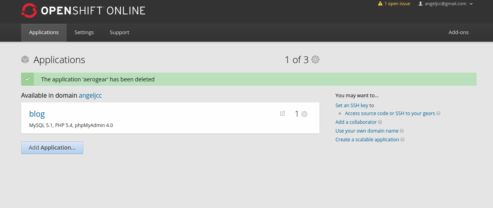

####Ejercicio 1
######_Instalar un entorno virtual para tu lenguaje de programación favorito (uno de los mencionados arriba, obviamente)._

Para instalar el entorno virtual virtualenv de Python, primero instalé python-pip con el siguiente comando:
```sh
sudo apt-get install python-pip
```
y a continuación:
```sh
pip install virtualenv

```
y luego ejecutamos la orden:
```sh
sudo pip virtualenv
```
***
####Ejercicio 2 y 3
######_Darse de alta en algún servicio PaaS tal como Heroku, Nodejitsu u OpenShift._
######_Crear una aplicación en OpenShift y dentro de ella instalar WordPress._
Estos dos ejercicios los he puesto juntos ya que me he dado de alta en OpenShift directamente y he creado una aplicación para poder utilizar WordPress.

Una Vez dado de alta en OpenShift, creamos una aplicacion nueva, en este caso será WordPress, le he puesto de nombre blog.  
  
Para poder acceder al blog pincha en el siguiente [enlace](http://blog-angeljcc.rhcloud.com).  


***
#### Ejercicio 4
###### _Crear un script para un documento Google y cambiarle el nombre con el que aparece en el menú, así como la función a la que llama._

Para crear un script en google drive nos vamos a [esta pagina](https://script.google.com) y elegimos lo que queremos hacer, el script para la aplicacion de google drive.
Este es el código para cambiar el menú.
```javascript

function onOpen() {
  var ui = DocumentApp.getUi();
  // Or DocumentApp or FormApp.
  ui.createMenu('Menu IV')
      .addItem('First item', 'menuItem1')
      .addSeparator()
      .addSubMenu(ui.createMenu('Sub-menu')
          .addItem('Second item', 'menuItem2'))
      .addToUi();
}

function menuItem1() {
  DocumentApp.getUi() // Or DocumentApp or FormApp.
     .alert('Has pulsado el primer Item!');
}

function menuItem2() {
  DocumentApp.getUi() // Or DocumentApp or FormApp.
     .alert('has pulsado el segundo Item!');
}

```

Al ejecutarlo nos pide permisos para poder ejecutarlo y listo! Ya lo tendremos en cualquier sitio de google drive nuestro menú personalizado!


***
####Ejercicio 5
######_Buscar un sistema de automatización de la construcción para el lenguaje de programación y entorno de desarrollo que usemos habitualmente._

Mirando en [wikipedia](http://en.wikipedia.org/wiki/List_of_build_automation_software) he visto una completa lista de sistemas de automatización, para python que es uno de los lenguajes que estoy utilizando más, [A-A-P](http://en.wikipedia.org/wiki/A-A-P), es el sistema que nos dan.
***

####Ejercicio 6
######_Identificar, dentro del PaaS elegido o cualquier otro en el que se dé uno de alta, cuál es el fichero de automatización de construcción e indicar qué herramienta usa para la construcción y el proceso que sigue en la misma._
Como estamos usando OpenShift he utilizado este PaaS para aprovecharlo.
Nos da una herramienta para poder gesionar las aplicaciones a través de la terminal y asi usarlo sin nada mas.
Es el comando  ```rhc``` para instalarlo hace falta instalar antes ruby y luego instalar rhc con los siguientes comandos:  
```sh
sudo gem install rhc
```
Y procedemos a configurarlo con:
```sh
rhc setup
```
Para la automatizacion existen dos formas:  
+ _**Jenkins**_: Servidor con todas las funciones de integración continua (CI) que puede ejecutar, construir, testear y programar tareas que se integran con las aplicaciones de OpenShift.
+ _**Hot Deployment**_: Con hot deployment se aplican los cambios al código de la aplicación sin necesidad de reiniciar la aplicación, aumentando la velocidad de despliegue y minimizando el tiempo de inactividad de la aplicación.

*** 
#### Ejercicio 7  
###### _Buscar un entorno de pruebas para el lenguaje de programación y entorno de desarrollo que usemos habitualmente._  


Para python he encontrado [Nose](http://pythontesting.net/framework/nose/nose-introduction/) es un framework para hacer test.
